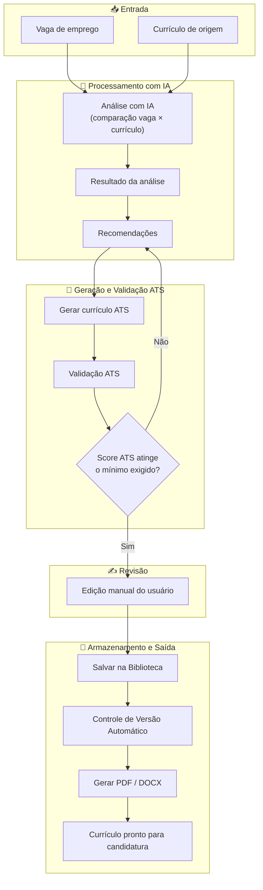

# 📄 RadarCV

> Inteligência de carreira com IA para transformar uma vaga de emprego em um currículo mais estratégico, direcionado e compatível com sistemas ATS.

[](#)
[](#)
[](#)
[](#)

---

# 📋 Sobre o projeto

O **RadarCV** é uma plataforma desenvolvida para auxiliar profissionais na preparação de currículos direcionados a oportunidades específicas de trabalho.

A proposta é utilizar Inteligência Artificial para analisar uma vaga de emprego, identificar os principais requisitos e características da oportunidade e, a partir dessas informações, gerar um currículo otimizado para sistemas de recrutamento baseados em **ATS: Applicant Tracking Systems**.

Além da análise e geração do currículo, a plataforma permite armazenar, editar, versionar e exportar os currículos gerados.

O projeto foi desenvolvido como um estudo prático envolvendo **desenvolvimento de software, Inteligência Artificial, banco de dados, autenticação, persistência de informações e integração entre diferentes serviços**.

---

# 🏁 Objetivo

O principal objetivo do RadarCV AI é tornar o processo de adaptação de um currículo para uma determinada vaga mais rápido, estruturado e orientado por dados.

Em vez de utilizar o mesmo currículo para diferentes oportunidades, o usuário pode analisar uma vaga específica e utilizar os resultados da análise para criar uma versão do currículo mais alinhada à oportunidade.

A plataforma busca combinar:

- análise de vagas;
- Inteligência Artificial generativa;
- otimização para ATS;
- organização de currículos;
- versionamento;
- exportação de documentos;
- persistência de dados.

---

# 💡 O problema

Um dos principais desafios enfrentados por candidatos durante uma busca por emprego é adaptar o currículo para diferentes oportunidades.

Uma mesma experiência profissional pode ser apresentada de diferentes maneiras dependendo dos requisitos da vaga.

Além disso, muitos processos seletivos utilizam sistemas ATS para realizar uma primeira análise dos currículos recebidos.

Isso cria alguns desafios:

- identificar rapidamente os requisitos mais importantes de uma vaga;
- descobrir quais palavras-chave estão presentes ou ausentes no currículo;
- entender os pontos fortes e fracos em relação à oportunidade;
- adaptar o currículo sem alterar fatos da experiência profissional;
- manter diferentes versões organizadas;
- produzir documentos em formatos adequados para envio.

O RadarCV AI foi desenvolvido para centralizar esse processo em uma única plataforma.

---

# 🛠️ A solução

O RadarCV transforma uma vaga de emprego em um fluxo estruturado de análise e preparação de currículo.

O fluxo principal da plataforma é:


# 🌐 Acesse o projeto
## Aplicação

URL: COLOCAR_AQUI_O_LINK_DA_APLICAÇÃO


# ✨ Principais funcionalidades
## 1. Landing Page

A página inicial apresenta a proposta do RadarCV e direciona o usuário para o acesso à plataforma.

### 📸 Screenshot


## 2. Cadastro e autenticação

O RadarCV possui fluxo de cadastro e autenticação de usuários.

O processo de cadastro conta com validações relacionadas às informações de acesso e senha, incluindo confirmação da senha.

### 📸 Screenshot


## 3. Dashboard

((( DESCRECER ESTA TELA DO SISTEMA ))


## 4. Analisar vaga

O usuário pode iniciar uma nova análise informando os dados de uma oportunidade de emprego.

### 4.1 - Etapa Vaga

O usuário pode iniciar uma nova análise informando os dados de uma oportunidade de emprego.

A Inteligência Artificial processa as informações da vaga e do currículo utilizado para produzir uma análise estruturada.

### 📸 Screenshot


### 4.2 - Etapa Curriculo

((( DESCRECER ESTA ETAPA E TELA DO SISTEMA ))

### 📸 Screenshot


### 4.3 - Etapa Objetivo

((( DESCRECER ESTA ETAPA E TELA DO SISTEMA ))

### 📸 Screenshot


### 4.4 - Etapa Resultado

Após o processamento, o sistema apresenta um resultado estruturado da análise da oportunidade.

Entre as informações apresentadas estão:

- percentual de compatibilidade;
- resumo da análise;
- pontos fortes;
- pontos de atenção;
- palavras-chave encontradas;
- Gaps identificados;
- recomendações;
- próximos passos.

### 📸 Screenshot


### 4.5 - Etapa Curriculo ATS

A partir da análise realizada, o RadarCV pode gerar uma versão direcionada do currículo.

O conteúdo é estruturado considerando as informações profissionais fornecidas pelo usuário e os requisitos identificados na oportunidade.

Nesta etapa o usuário tem as seguintes informações para sua decisão:
- Checklist ATS: Permite verificar diferentes aspectos relacionados à estrutura e ao conteúdo do currículo antes de sua utilização.
- Palavras Chaves: Permite verificar as chaves encontradas e destacadas no curriculo
- Botões:
- Copiar conteúdo;
- Exportar PDF;
- Exportar DOCX;
- Editar: Currículo pode ser editado para revisar e ajustar o conteúdo do currículo antes do salvamento ou exportação.
- Salvar na Biblioteca: Grava o currículo ATS na biblioteca de currículos


## 5. Biblioteca de Currículos

A Biblioteca centraliza os currículos criados e importados pelo usuário.

A partir dela é possível acessar os documentos e executar ações como:

- copiar conteúdo;
- exportar PDF;
- exportar DOCX;
- editar;
- excluir;
- gerar uma nova versão.

### 5.1 Importar Currículo

Por este recurso o usuário consegue importar currículos para seu controle ou escolha para análises futuras

### 5.2 Currículo padrão

O usuário pode definir um currículo como padrão.

Essa referência facilita a utilização do currículo principal durante novas análises.

### 5.3 Versionamento

O RadarCV mantém diferentes versões dos currículos ATS.

Isso permite organizar a evolução dos documentos e manter versões associadas às análises que deram origem a eles.

### 📸 Screenshot


## 6. Histórico de análises

O sistema mantém o histórico das análises realizadas.

O usuário pode consultar análises anteriores e acessar novamente os resultados relacionados a cada oportunidade.


## 7. Configurações

((( DESCRECER ESTA TELA DO SISTEMA ))


# 🏗️ Arquitetura

O RadarCV AI utiliza uma arquitetura baseada em aplicação web, funções server-side e serviços gerenciados.

                         ┌──────────────────┐
                         │     Usuário       │
                         └────────┬─────────┘
                                  │
                                  ▼
                    ┌─────────────────────────┐
                    │      Interface Web      │
                    │    React + TanStack     │
                    │          Start          │
                    └────────────┬────────────┘
                                 │
                                 ▼
                    ┌─────────────────────────┐
                    │     Server Functions    │
                    │ Processamento server-side│
                    └────────────┬────────────┘
                                 │
                  ┌──────────────┴──────────────┐
                  │                             │
                  ▼                             ▼
       ┌─────────────────────┐       ┌─────────────────────┐
       │       Supabase      │       │ Inteligência        │
       │                     │       │ Artificial          │
       │ • Auth              │       │                     │
       │ • PostgreSQL        │       │ • Análise de vagas  │
       │ • Storage            │       │ • Geração ATS       │
       │ • RLS                │       │ • Tradução          │
       └─────────────────────┘       └─────────────────────┘

### Camadas principais

### Frontend

Responsável pela interface e interação com o usuário.

### Server Functions

Responsáveis pelo processamento server-side e pela execução das operações que fazem parte da lógica da aplicação.

### Supabase

Utilizado para autenticação, banco de dados, armazenamento de arquivos e controle de acesso através de RLS.

### Inteligência Artificial

Utilizada nos processos de análise da vaga, geração dos currículos e demais recursos relacionados ao processamento de linguagem.

# 🗄️ Estrutura de dados

O projeto utiliza PostgreSQL através do Supabase.

Entre as principais entidades utilizadas estão:

### Entidade	Responsabilidade
| resumes | Armazena os currículos dos usuários |
| analyses | Armazena as análises realizadas |
| analysis_results | Armazena os resultados detalhados das análises |
| ats_resumes | Armazena os currículos ATS gerados |
Relacionamento simplificado
```text
┌──────────────┐
│   resumes    │
└──────┬───────┘
       │
       │
       ▼
┌──────────────┐
│   analyses   │
└──────┬───────┘
       │
       ├───────────────────┐
       │                   │
       ▼                   ▼
┌──────────────────┐ ┌──────────────┐
│ analysis_results │ │ ats_resumes  │
└──────────────────┘ └──────────────┘

🔐 Segurança

A aplicação utiliza recursos de segurança fornecidos pelo Supabase e pela arquitetura server-side.

Entre os mecanismos utilizados estão:

autenticação de usuários;
rotas protegidas;
identificação do usuário autenticado;
Row Level Security (RLS);
controle de acesso aos dados;
armazenamento de arquivos com controle por usuário;
operações server-side.

O objetivo é garantir que os dados de currículos e análises sejam associados ao usuário correto.

🛠️ Tecnologias utilizadas
Tecnologia	Utilização
React	Interface da aplicação
TypeScript	Desenvolvimento e tipagem
TanStack Start	Framework da aplicação
TanStack Router	Roteamento
Tailwind CSS	Estilização
Supabase	Backend como serviço
PostgreSQL	Banco de dados
Supabase Auth	Autenticação
Supabase Storage	Armazenamento de arquivos
Row Level Security	Controle de acesso aos dados
Server Functions	Processamento server-side
Generative AI	Análise e geração de conteúdo
PDF	Exportação de currículos
DOCX	Exportação de currículos
GitHub	Versionamento do código
Lovable	Desenvolvimento assistido por IA

🤝 Desenvolvimento assistido por Inteligência Artificial

O RadarCV também representa um estudo sobre o uso de Inteligência Artificial no próprio processo de desenvolvimento de software.

O projeto foi desenvolvido utilizando uma abordagem de desenvolvimento assistido por IA, explorando ferramentas capazes de auxiliar em diferentes etapas, como:

estruturação da aplicação;
implementação de funcionalidades;
criação e evolução da interface;
integração com serviços;
análise de código;
identificação de problemas;
documentação;
refinamento da experiência do usuário.

O objetivo não foi apenas utilizar IA como funcionalidade do produto, mas também investigar como ferramentas de IA podem participar do próprio processo de desenvolvimento de software.

🧠 Aprendizados e desafios

O desenvolvimento do RadarCV proporcionou aprendizados em diferentes áreas.

Desenvolvimento de produto

Foi necessário transformar uma ideia inicial em um fluxo de utilização coerente, conectando análise de vaga, geração de currículo, edição, armazenamento e exportação.

Integração entre IA e aplicação

Um dos desafios foi estruturar a comunicação entre a aplicação e os processos de Inteligência Artificial, mantendo os dados organizados e utilizáveis pelas etapas seguintes.

Persistência de dados

Outro ponto importante foi garantir que análises, currículos e versões permanecessem disponíveis após sua criação.

Versionamento

O gerenciamento de diferentes versões de currículos exigiu uma estrutura capaz de relacionar documentos às análises que deram origem a eles.

ATS

O projeto também permitiu explorar conceitos relacionados a sistemas de rastreamento de candidatos e à necessidade de estruturar currículos de forma adequada para processamento automatizado.

Segurança

A utilização de autenticação, RLS e armazenamento controlado permitiu aprofundar o entendimento sobre proteção e isolamento de dados em aplicações multiusuário.

Desenvolvimento assistido por IA

O projeto também serviu como laboratório para compreender os benefícios e limitações do desenvolvimento utilizando ferramentas de geração de código e assistência por Inteligência Artificial.

📈 Evolução do projeto

O RadarCV foi desenvolvido de forma incremental.

O projeto passou por diferentes ciclos de desenvolvimento, nos quais funcionalidades foram implementadas, testadas e refinadas.

🧪 Validação da aplicação

Durante o desenvolvimento, os principais fluxos da aplicação foram testados.

Entre os fluxos validados estão:

cadastro;
autenticação;
análise de vaga;
apresentação do resultado;
geração de currículo ATS;
checklist ATS;
edição;
salvamento;
Biblioteca;
versionamento;
exportação PDF;
exportação DOCX;
cópia do currículo;
opções de objetivo, exemplo tradução para o idioma inglês;
histórico de análises.

🔮 Próximas evoluções

O RadarCV pode evoluir futuramente para incorporar novos recursos relacionados à carreira e recrutamento.

Algumas possibilidades incluem:

análise de múltiplas vagas;
acompanhamento de candidaturas;
métricas de evolução dos currículos;
melhorias na análise ATS;
recomendações mais personalizadas;
integração com plataformas de recrutamento;
acompanhamento do processo seletivo;
recursos adicionais de preparação para entrevistas;
novos formatos de exportação;
evolução dos recursos de Inteligência Artificial.

As funcionalidades acima representam possibilidades futuras e não fazem parte da implementação atual.

```
## 👨‍💻 Autor

Desenvolvido por **Marcelo Poliato de Oliveira** como projeto prático de desenvolvimento assistido por IA Generativa.

[](https://www.linkedin.com/in/marcelo-poliato)
[](https://github.com/poliato2015-max)


